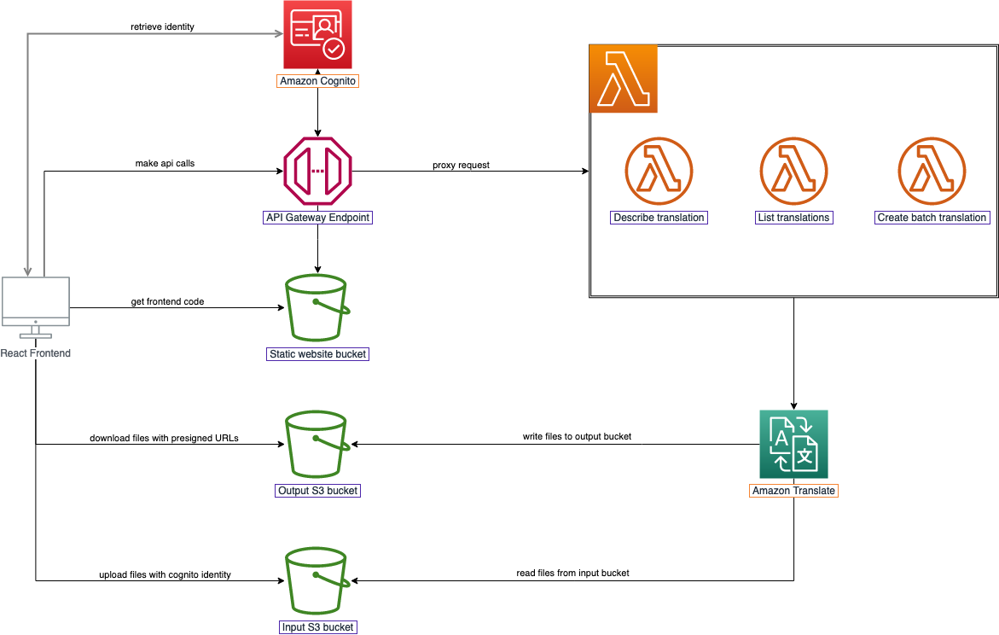

# AMZTrans
Last update 12 July, 2022

This is a demo project to demonstrate Amazon Translate service. The users will be able to upload multiple files at once and create a translation job for those files.


## Installation
To run this project, you must have `AWS CLI`, `CDK v2 CLI`, `npm`, `python 3` installed on the machine you are running. See the external links below for instructions to install the required softwares.

- [Install AWS CLI](https://docs.aws.amazon.com/cli/latest/userguide/getting-started-install.html)
- [Install CDK](https://docs.aws.amazon.com/cdk/v2/guide/getting_started.html)
- [Install npm](https://docs.npmjs.com/downloading-and-installing-node-js-and-npm)
- [Install python 3](https://www.python.org/downloads/)

### Setup the CDK environment

Configure the aws configuration to use the region `ap-northeast-2 (Seoul)`.

In the `deployment` directory, install the required packages by running the following command
```
pip install -r requirements.txt
```

If you are running cdk for the first time, bootstrap the CDK resource by running
```
cdk bootstrap
```

### Setup the React project
In the `amztrans-ui` directory, install the required packages by running the following command
```
npm install
```

## Deploy the solution


### Configuration
Config default account email in `deployment/cdk/constant.py`. This email would be use as the email of the default account. First-time login password and password change request will be sent to this email address, so make sure that you use a valid one.
```
...
DEFAULT_EMAIL="[YOUR_EMAIL_ADDRESS]"
...
```

### Deploy the CDK template

#### Deploy on CloudFront + S3
To deploy and run the app on Amazon CloudFront and S3, deploy the stack in production mode. This stack will create an additional stack with S3 and CloudFront.
```
cd deployment && cdk deploy
```

The output will be as following
```
...
✨  Deployment time: 461.92s

Outputs:
amztrans-demo.APIGATEWAYENDPOINT = https://umw58q6nyi.execute-api.ap-northeast-2.amazonaws.com/prod/
amztrans-demo.CLOUDFRONTURL = d6jk6c50vhyka.cloudfront.net
amztrans-demo.COGNITOUSERPOOLENDPOINT = https://amztrans-domain.auth.ap-northeast-2.amazoncognito.com/oauth2/authorize?client_id=2rnp8on2sfub1gf70jttadmlue&response_type=token&scope=email+openid&redirect_uri=https://d6jk6c50vhyka.cloudfront.net/auth
amztrans-demo.IDENTITYPOOLID = ap-northeast-2:9bb62d0e-7117-4cf8-be14-6dc758d73816
amztrans-demo.INPUTBUCKETNAME = amztrans-demo-s3stacknested-amztransinput41e53db2-13q2eldxqieg9
amztrans-demo.OUTPUTBUCKETNAME = amztrans-demo-s3stackneste-amztransoutputf9a36510-s94wzi5gb8eg
amztrans-demo.STATICBUCKETNAME = amztrans-demo-statichostne-amztransstaticcc20186a-1v4s1ln0ma2i4
```

Navigate to the `amztrans-ui` directory. Rename the `.env.example` file to `.env`. Replace the corresponding value taken from the CDK deployment output above. 
```
VITE_COGNITO_USERPOOL_ENDPOINT=[amztrans-demo.COGNITOUSERPOOLENDPOINT]
VITE_APIGATEWAY_ENDPOINT=[amztrans-demo.APIGATEWAYENDPOINT]
VITE_IDENTITY_POOL_ID=[amztrans-demo.IDENTITYPOOLID]
VITE_INPUT_BUCKET_NAME=[amztrans-demo.INPUTBUCKETNAME]
VITE_OUTPUT_BUCKET_NAME=[amztrans-demo.OUTPUTBUCKETNAME]
VITE_REGION=ap-northeast-2
```

Build the frontend project in `amztrans-ui`
```
npm run build
```

Upload the build files to the static s3 bucket
```
aws s3 cp build s3://[amztrans-demo.STATICBUCKETNAME] --recursive
```

Navigate to the CloudFront distribution URL `amztrans-demo.CLOUDFRONTURL`


#### Running locally
To run the app on local development, deploy the stack in development mode. This stack will not create static hosting resources with S3 and CloudFront
```
cd deployment && cdk deploy --app "python app_dev.py"
```

The output would be as following
```
...
✨  Deployment time: 325.18s

Outputs:
amztrans-demo-dev.APIGATEWAYENDPOINT = https://riw2fk7wti.execute-api.ap-northeast-2.amazonaws.com/prod/
amztrans-demo-dev.CLOUDFRONTURL = localhost:3000
amztrans-demo-dev.COGNITOUSERPOOLENDPOINT = https://amztrans-domain.auth.ap-northeast-2.amazoncognito.com/oauth2/authorize?client_id=1hh6hieuds9vh57teb9rs7ob70&response_type=token&scope=email+openid&redirect_uri=http://localhost:3000/auth
amztrans-demo-dev.IDENTITYPOOLID = ap-northeast-2:e67263db-c5f9-43c3-a985-1c0733f859b6
amztrans-demo-dev.INPUTBUCKETNAME = amztrans-demo-dev-s3stackne-amztransinput41e53db2-1csulazcpozlt
amztrans-demo-dev.OUTPUTBUCKETNAME = amztrans-demo-dev-s3stackn-amztransoutputf9a36510-17bdaeuxoopqr
amztrans-demo-dev.STATICBUCKETNAME = None
```

Navigate to the `amztrans-ui` directory. Rename the `.env.example` file to `.env`. Replace the corresponding value taken from the CDK deployment output above. 

Start the react development server
```
npm start
```

Access the app at `http://localhost:3000`


#### Note
At the first time login, you will have to change the password. The default username is `public`. The default password will be sent to the email that you've configured in `deployment/cdk/constant.py`. Make sure that you enter an available email address.


## Clean up
To clean up all the resources, run the following command in the project root directory
```
cdk destroy
```

## Action items
### Todo
- [ ] Improve security by authenticating React client with Cognito (currently using anonymous).
- [ ] Auto build code from CloudFormation template output and upload to S3 bucket for static file hosting. Currently, the files need to be manually built and upload to S3.
